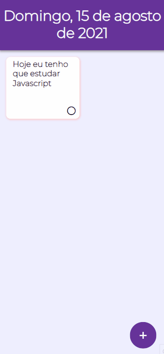

<h1>Todo App</h1>

## Sobre
Um simples todo app utilizando HTML, CSS e Javascript
<div style="display: inline_block">
    
    
    
</div>
<br>

## Demonstração


## Pré-requisitos
Antes de começar, você precisa ter instalado o <a href="https://git-scm.com/">GIT</a> na sua máquina.
Você pode abrir o arquivo HTML direto dos seus arquivos, ou se preferir, instale o <a href="https://code.visualstudio.com/">Visual Studio Code</a> e sua extensão Live Server.

### Rodando a aplicação com o VSCode

```bash
# Clone este repositório
$ git clone <https://github.com/dnruby/todo-app.git>

# Entre na pasta do projeto no terminal/cmd
$ cd todo-app

# Abra a aplicação no VSCode
$ code .

# Ative o Live Server
$ Alt+L Alt+O

```

<b>Autor:</b> <a href="https://www.linkedin.com/in/daniel-vinicius-19a41b122/">Daniel Vinícius</a>
