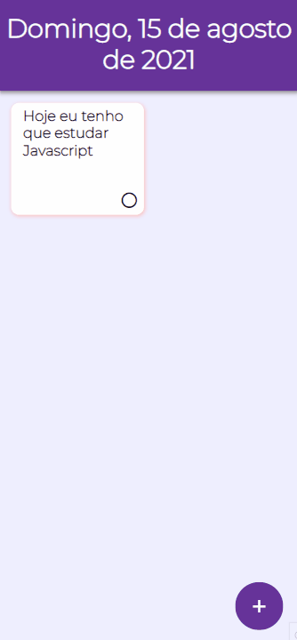

<h1>To-Do App</h1>

## About
A simple to-do app using HTML, CSS and Javascript
<div style="display: inline_block">
    
    
    
</div>
<br>

## The app


## Running the app on VSCode

```bash
# Clone this repository
$ git clone <https://github.com/dnruby/todo-app.git>

# Enter the project folder on terminal/cmd
$ cd todo-app

# Open the app on VSCode
$ code .

# Install and activate Live Server Extension
$ Alt+L Alt+O

```
Install <a href="https://git-scm.com/">GIT</a> and <a href="https://code.visualstudio.com/">Visual Studio Code</a> on your computer.
<br><br>
<b>Author:</b> <a href="https://www.linkedin.com/in/daniel-vinicius-19a41b122/">Daniel Vinícius</a>
